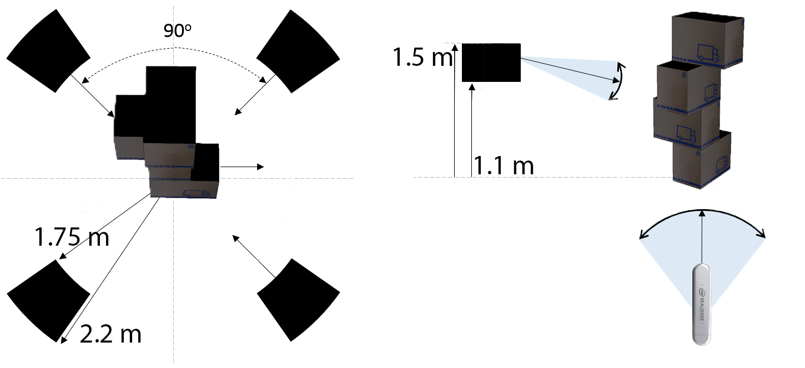

# Calibrating a Volumetric Setup

## Sensors Placement 

The formerly placed calibration structure acts as the global coordinate system anchor. 
The following guidelines need to hold for successfully calibrating a volumetric setup:
- The setup requires all sensors to be placed __perimetrically around the calibration structure and looking inwards (i.e., towards the structure)__. 
- All sensors should be placed vertically (i.e., flipped 90o clockwise and connections are facing bottomwards) to enable the capturing of the object at closer distance exploiting sensor's wide horizontal field of view.
- An evenly spread out coverage of the sensors around the desired object to be captured in full-360o should be ensured.
- All viewpoints should target the middle of the structure in a way that the __structure is depicted at the center of the received images__ both horizontally and vertically. 
- Considering the specific field-of-view of the sensors and with a view to capturing a standing person at the center of the capturing space, all sensors must be positioned at a __distance from the structure ranging from 1.75 to 2.5 meters__.
- Finally, the __distance from the ground of all sensors must be between 1.1 and 1.5 meter__.

In cases where performance might seem subpar, please make sure that sensors are placed in ways that view **8** sides of the boxes to exploit the discriminative power of the model.
{: .label .label-purple }

An outline of a good positioning of `4` sensors is depicted in the following figure.

Specifically for Intel RealSense 2.0 D415 sensors, increasing the laser power at its maximum value during calibration image acquisition is beneficial to the process, as the better depth accuracy improves the final pose estimates.

While this is set to be automatic, (_i.e._ switching to maximum laser power when capturing for calibration, and then reverting it back to the default value once finished), please always check
__to revert the laser power value to its default in order to prevent device failure or damage__.
{: .label .label-purple }

## Calibration Workflow

After initially placing the structure, an iterative process of finetuning the sensors' placement and viewing angles should follow to ensure that the entire structure is visible from all sensors by inspecting the live feeds in **VolCap**.

Then, the calibration process steps are:

1. From the top menu, `Calibration`->`Configure` to check and set the calibration parameters (set **iterations** to maximum for optimal calibration).
2. Then, `Calibration`->`Capture` to capture snapshots of the depth streams.
3. When snapshot capturing is completed, `Calibration`->`Calibrate` starts the actual pose parameter estimation.
4. Once the process has finished, use the `Load Latest` button on the down-left side of the calibration pop-up.
5. (**alternative**) If the sensors have been already calibrated and not moved, the latest calibration is already available. Therefore, after connecting the sensors, `Calibration`->`Load Latest` will load them, bypassing the need to perform the calibration process again.

    

    

    

Once the calibration is finished, you should be able to see the sensors live point-cloud streams forming the calibration structure's shape. Additional inspection/visualization aid is available by toggling the `Structure` tick box from the `Viewport Control` widget.