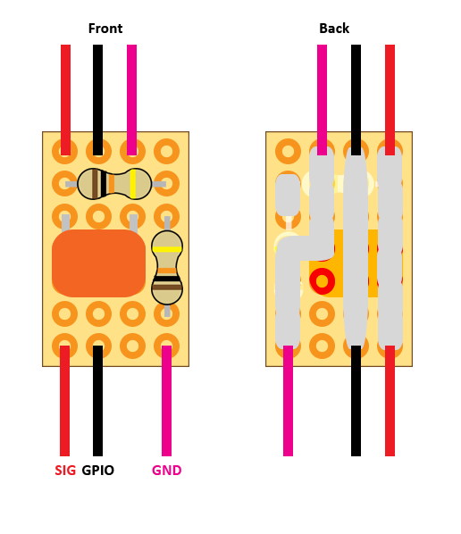
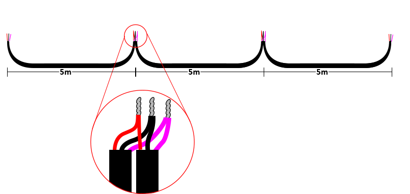

# Hardware Sync
{: .no_toc }

The simultaneous triggering of all acquisition processes between different cameras is realized with external hardware synchronization cables.

## Hardware Synchronization Cables

Intel RealSense 2.0 devices offer HW synchronization through a GPIO port placed on top of the device.

To achieve this, one needs to assemble a set of cables that enable the **Master** device to send trigger signals to the **Slave** devices.

### Parts

Here is the list of materials and parts needed for a cable that connects **one** master device with **one** slave:

* 2 x [Connector Housing](http://export.farnell.com/jst-japan-solderless-terminals/shr-09v-s-b/connector-housing-9way/dp/1679115).
* If you only want to use the GPIO port for external syncing between the system's devices then you need only two cables. 
However, if you want to use any features that may become available by Intel (and make use of other pins of the GPIO port) in the future, then you will need 9 cables for each device-to-device connection. 
We recommend a good shielded 9-core ribbon cable like [this](http://export.farnell.com/3m/3659-9/ribbon-cable-rnd-flat-9way-30/dp/297057?st=3659-9%20RIBBON%20CABLE).
* Additionally, you will have to get 4 (or 18) x [connector contacts](http://export.farnell.com/jst-japan-solderless-terminals/ssh-003t-p0-2/crimp-terminal-sh-series/dp/1679142).
* If you cannot assemble your own cables, there is a chance to find and purchase ready-made cables but with limited options regarding their length.
* You can find further instructions about assembling the hardware sync cables in the corresponding [Intel's white paper](https://realsense.intel.com/wp-content/uploads/sites/63/Multiple_Camera_WhitePaper_rev10.pdf). 

In order to assemble the synchronization cables for the Intel RealSense sensors, the following materials are needed:

* 3-core shielded cable - `30m` (meters). [Recommendation](https://export.farnell.com/belden/76103ws-008100/shld-flex-cable-3cond-26awg-100ft/dp/2800260)
* 4 x [JST SH Connectors](https://export.farnell.com/jst-japan-solderless-terminals/shr-09v-s-b/connector-housing-9way/dp/1679115?st=JST%20SH)
* 12 x [JST SH Crimp pins](https://export.farnell.com/jst-japan-solderless-terminals/ssh-003t-p0-2/contact-socket-32-28awg-crimp/dp/2479942?st=JST%20SH) (You should get a lot more (like 100), because they are really small and break easily if you are not really careful when assembling the connectors - plus they are really cheap -)
* 4 x 20K Resistors and 22nF Capacitors (Again, you should get a lot more; it is easy to make mistakes)
* 1 x [PA-09 Crimping Tool](https://www.amazon.com/Engineer-PA-09-Micro-Connector-Crimpers/dp/B002AVVO7K)

### Instructions

First, the pins that need to be connected are pins #1, #5, and #9. 

- `Pin #1` is the ground pin.
- `Pin #5` is the synchronization signal pin
- `Pin #9` is the General Purpose Input/Output (GPIO) pin

The schematic for the RC-filters is described in Intel's [white paper](https://realsense.intel.com/wp-content/uploads/sites/63/Intel_RealSense_Multi-camera_Webinar.pdf). 

In order to avoid ESD events (electro-static discharge events)* a simple passive low-pass RC filter is needed.
{: .label .label-yellow }

A simple breadboard illustration is presented bellow:

Cable length between each sensor should be about `5m` long.

### Assembly Video

<iframe width="560" height="315" src="https://www.youtube.com/embed/E3PzERRZgHU" frameborder="0" allow="accelerometer; autoplay; clipboard-write; encrypted-media; gyroscope; picture-in-picture" allowfullscreen></iframe>